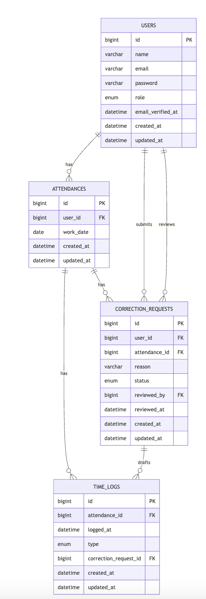

# アプリケーション名

勤怠管理アプリ

-----


# セットアップ手順


-----

##  セットアップ

### 1\. リポジトリのクローン

まず、プロジェクトのリポジトリをローカルにクローンし、ディレクトリに移動します。

```bash
git clone git@github.com:matsuoka1985/attendance-management-system.git
cd attendance-management-system
```

### 2\. Dockerコンテナの起動


```bash
docker compose up -d --build
```

### 3\.  PHPコンテナへアクセス

PHPコンテナのシェルに入るには、以下のコマンドを使用します。

```bash
docker compose exec php bash
```

### 4\. 初期セットアップ

phpコンテナにログインした状態において以下のコマンドを実行することでcomposer installによるvendorディレクトリの作成、.envファイルの作成、APP_KEYの生成、マイグレーション、シーディングが一括で実行できます。
```bash
make setup
```

-----

##  テスト


### 1\. PHPUnitテストの実行


```bash
php artisan test
```

### 2\. Laravel Duskテストの実行


```bash
php artisan dusk
```

-----

##  アクセス情報

全てのコンテナが起動し、アプリケーションのセットアップが完了すると、以下のURLで各サービスにアクセスできます。

  * **Laravel アプリケーション**: [http://localhost:80](http://localhost:80)
  * **MailHog (開発用メール UI)**: [http://localhost:8025](http://localhost:8025)
  * **phpMyAdmin (データベース管理GUIツール UI)**: [http://localhost:8080](http://localhost:8080)


### 管理者アカウント情報

以下の認証データによって管理者アカウントでログインできます：

- メールアドレス: `admin@example.com`
- パスワード: `password`


---

## 使用技術(実行環境)

* PHP 8.2.28
* Laravel 11.45.1
* MySQL 8.0.37
* nginx 1.21.1

---

## ER図



